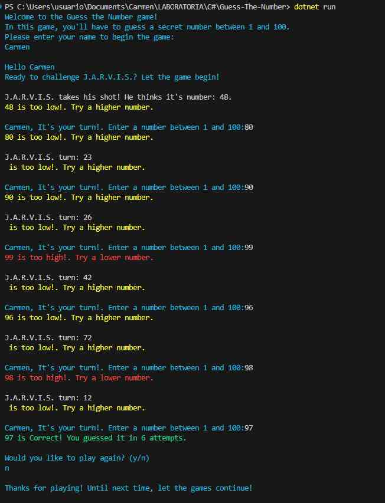

### Guess The Number

Guess The Number is an interactive game developed in C# that challenges players to guess a secret number between 1 and 100. The game takes place in the terminal, where both the player and the computer take turns trying to guess the number.

#### Project Summary

The project focuses on building a console application in C# that implements the logic of the "Guess The Number" game. The player and the computer take turns trying to guess the secret number, providing feedback after each guess. The game ends when one of the players guesses the secret number.

#### Learning Objectives

The project addresses the following learning objectives:

- Object-Oriented Programming (OOP): Concepts of classes, objects, methods, encapsulation, abstraction, inheritance, and interfaces are applied.
- C# Language: Variables, conditionals, loops, operators, and namespaces are used.
- Data Handling: Primitive and non-primitive data types are worked with, and collections like lists and arrays are used.
- Input/Output: The console is used for data input and message output.
- Unit Testing: Unit tests with MSTest are implemented to validate the game's functionality.

#### Project Milestones

1. **Development Environment Setup**: Installation of the .NET SDK, development environment setup, and creation of a console project in C#.
2. **Control Structures and Input/Output**: Implementation of basic control structures and interaction with the console to request and display messages.
3. **Classes and Objects**: Creation of classes to encapsulate the game's functionality and manage interactions between players.
4. **Encapsulation and Class Methods**: Refactoring of the code to protect the internal state of classes and creation of specific methods to handle game functionalities.
5. **Inheritance and Polymorphism**: Transformation of the main class into an abstract class, and creation of derived classes to represent different types of players.
6. **Unit Testing Implementation**: Development of unit tests with MSTest to validate the logic and functionality of the game.

#### Technical Considerations

- **.NET Version**: The project is based on .NET 5.0 or higher.
- **Project Structure**: The code is organized into separate classes to maintain modularity and code clarity.
- **Documentation and Comments**: The code is well-documented with comments to facilitate understanding and maintenance.

#### UML Diagram

In order to provide a visual representation of the class structure and relationships within the "Guess The Number" game project, the following UML diagram is presented:

This diagram illustrates the various classes, their attributes, and their relationships, helping to understand the project's architecture and design.

#### Understanding the UML Diagram

- **Program**: This class contains the main method (`Main`) that starts the game.
- **Game**: This class models the game and contains the main game logic, such as random number generation, guess verification, and managing the game flow.
- **Player**: It's an abstract class serving as a base for the game's players. It contains methods and properties common to all players.
- **HumanPlayer**: This class inherits from `Player` and represents the human player in the game. It contains logic for the human player to make a guess.
- **AIPlayer**: This class also inherits from `Player` and represents the AI-controlled player in the game. It contains logic for the AI to make a guess.

#### Console Output

To run the game, simply start the project from the terminal and follow the instructions displayed. Have fun playing and exploring the logic behind the "Guess The Number" game in C#.

#### Installation and Requirements

To run the game on your local machine, make sure you have the [.NET SDK](https://dotnet.microsoft.com/download) installed. Once installed, follow these steps:

1. Clone this repository to your local machine.
2. Open a terminal in the project directory.
3. Run the command `dotnet run` to start the game.

#### Author

Carmen Luna /
[LinkedIn Profile](https://www.linkedin.com/in/carmen-luna-cllp/)